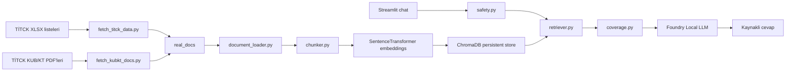

# Mimari

Yerel Eczacilik RAG Asistani, resmi TİTCK kaynaklarini yerelde isleyip ChromaDB uzerinden geri getirme yapan ve cevabi Foundry Local LLM ile uretebilen bir RAG uygulamasidir.

## Akis

## Bilesenler

- Veri toplama: `scripts/fetch_titck_data.py`, TİTCK resmi XLSX listelerini indirir ve metin korpusu uretir.
- KUB/KT toplama: `scripts/fetch_kubkt_docs.py`, TİTCK KUB/KT sayfasindan urun bazli PDF indirir.
- Belge okuma: `rag/document_loader.py`, PDF/TXT/Markdown kaynaklarini standart belge nesnesine cevirir.
- Chunking: `rag/chunker.py`, uzun metinleri bolum farkindalikli parcalara ayirir.
- Vektor veritabani: `rag/vector_store.py`, ChromaDB kalici koleksiyonu ve embedding modelini yonetir.
- Retrieval: `rag/retriever.py`, semantic arama, ilac filtresi ve sorgu terimi skor artirimi yapar.
- Kapsam kontrolu: `rag/coverage.py`, sadece liste kaydi olan durumlarda klinik detay uydurmayi engeller.
- Guvenlik: `rag/safety.py`, acil durum, doz degisikligi ve kisisel tibbi tavsiye sorularini yakalar.
- Uretim: `rag/generator.py`, Foundry Local OpenAI uyumlu endpoint'ine baglanir.
- Arayuz: `app.py`, Streamlit sohbet arayuzu ve veri yonetim panelini sunar.

## Veri Modlari

- Resmi liste modu: Tum ruhsatli urun ve e-recete listeleri uzerinden urun adi, barkod, etkin madde, ATC, firma ve ruhsat bilgisi gibi kayit sorulari cevaplanir.
- KUB/KT modu: Secili ilaclarin resmi KUB/KT PDF'leri eklendiginde yan etki, saklama, kullanim uyarilari ve benzeri prospektus bilgileri cevaplanir.
- LLM kapali modu: Foundry Local endpoint'i kapaliyken uygulama hata vermek yerine bulunan kaynak parcasi ozetlerini gosterir.

## Guvenlik Sinirlari

Uygulama teshis, tedavi, doz degisikligi veya kisisel ilac kullanma karari vermez. Acil durum ifadelerinde 112 veya en yakin saglik kurulusuna yonlendirir. Cevaplar sadece yuklenen belgelerde bulunan metinlere dayalidir.
